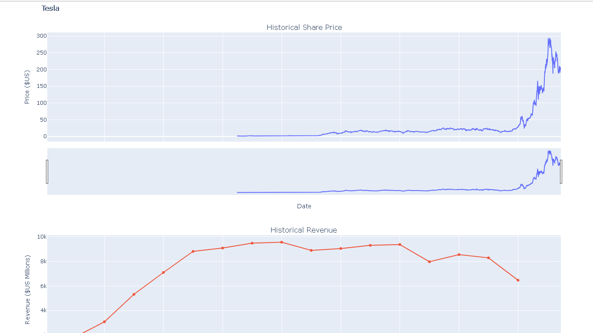
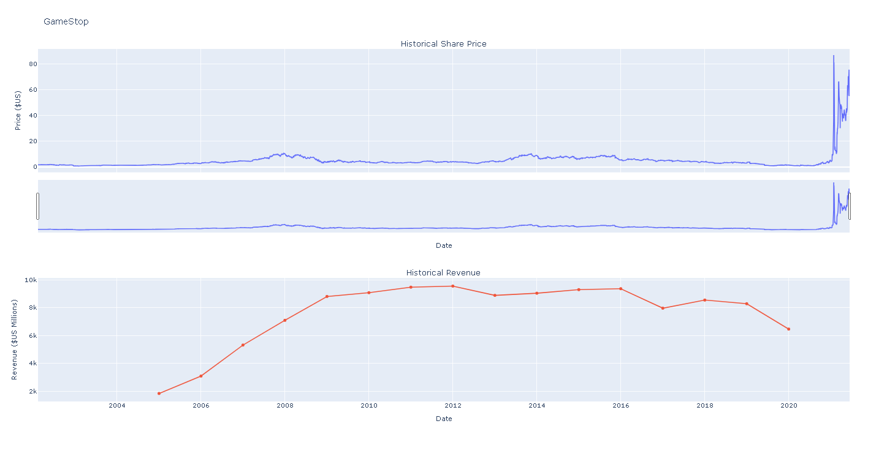

# Tesla-GME-Stock-Analysis
(Extracting and Visualizing Stock Data)

## Description
This project demonstrates how to **extract, clean, and visualize stock and revenue data** for Tesla and GameStop (GME). The goal is to analyze financial trends and create interactive visualizations using Python.

## Table of Contents
1. [Overview](#overview)
2. [Libraries](#libraries)
3. [Data Extraction & Cleaning](#data-extraction--cleaning)
4. [Visualization](#visualization)
5. [License](#license)

---

## Overview
- **Objective:** Extract stock and revenue data, clean it, and visualize trends.  
- **Datasets:** Tesla and GameStop (GME) stock & revenue data.  
- **Key Steps:**  
  1. Extract data via **yfinance** and **web scraping**.  
  2. Clean data for analysis.  
  3. Visualize trends using interactive graphs.

---

## Libraries
python
import yfinance as yf
import pandas as pd
import requests
from bs4 import BeautifulSoup
import plotly.graph_objects as go

## Data Extraction & Cleaning

- **Stock Data Extraction:** Use `yfinance` to fetch historical stock prices.  
- **Revenue Data Extraction:** Scrape revenue tables from websites using `BeautifulSoup`.  

### Cleaning Steps
1. Convert **Date** columns to `datetime` format.  
2. Remove `$` and `,` from revenue and convert to numeric.  
3. Drop invalid rows (`NaN` or `NaT`) to ensure accurate plotting.

---

## Visualization

- Use the provided `make_graph` function to plot stock and revenue data.

## Tesla Stock Graph

## GameStop (GME) Stock Graph

---

## License

**All Rights Reserved.** No part of this code may be copied, redistributed, or reused without explicit permission.

This project was originally completed as part of the IBM Data Analyst course on Coursera. The notebook has been adapted to include only the analysis, and visualizations completed by the author. All template instructions, logos, and login information provided by the course have been removed for clarity and presentation.
